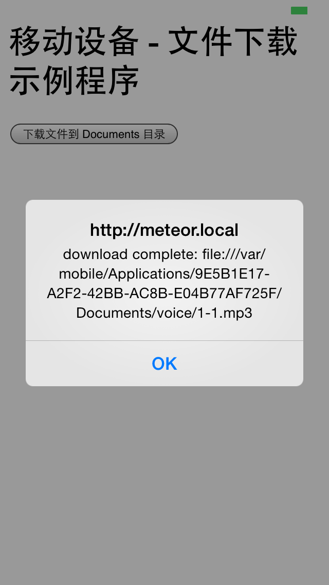

# 移动设备 - 文件下载示例程序

File Download Demo for Meteor on Mobile Device

## 注意

必须要包括mobile-config.js文件，否则将返回 ERROR whitelist rejection 401错误
mobile-config.js文件内容如下

	App.accessRule("*");

## 简介

- 从网络下载mp3文件到移动设备的Documents目录
- 使用包 https://github.com/apache/cordova-plugin-file-transfer/
- 使用包 https://github.com/apache/cordova-plugin-file/

## 截图

## 使用的包

	$ meteor list

	autopublish                               1.0.3  Publish the entire database to all clients
	cordova:org.apache.cordova.file           1.3.3
	cordova:org.apache.cordova.file-transfer  0.5.0
	insecure                                  1.0.3  Allow all database writes by default
	meteor-platform                           1.2.2  Include a standard set of Meteor packages in your app

## 下载

下载源代码：[请戳这里](https://github.com/MeteorChina/MeteorDemo/archive/master.zip)

## 感谢

- https://github.com/apache/cordova-plugin-file
- https://github.com/apache/cordova-plugin-file-transfer/
- 需要翻墙 http://www.html5rocks.com/en/tutorials/file/filesystem/

若您要发表评论或提交问题，[请戳这里](https://github.com/MeteorChina/MeteorDemo/issues)

[dyh](https://github.com/dyh) 说：助人乃快乐之本！  ^_______^