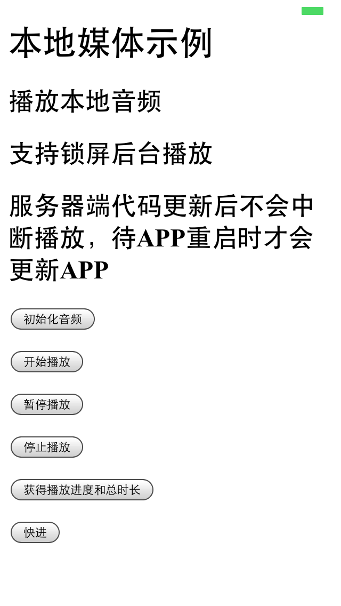
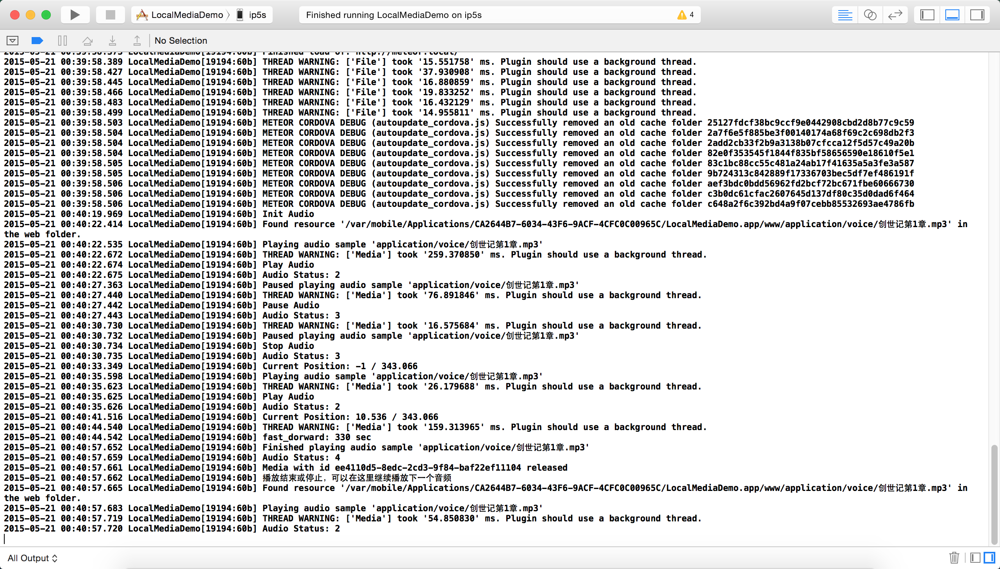

# 移动设备 - 操作本地媒体示例程序

Local Media Demo for Meteor on Mobile Device

##简介

- 可以播放documents目录下的文件
- 也可以播放www目录下的文件
- 支持锁屏后台播放
-- cordova:de.appplant.cordova.plugin.background-mode
- 服务器端代码更新后不会中断播放，待APP重启时才会更新APP
-- mdg:reload-on-resume

若您要发表评论或提交问题，[请戳这里](https://github.com/MeteorChina/MeteorDemo/issues)

## 使用的包

$ meteor list

- autopublish                                         1.0.3  Publish the entire database to all clients
- cordova:de.appplant.cordova.plugin.background-mode  0.6.4
- cordova:org.apache.cordova.media                    0.2.16
- insecure                                            1.0.3  Allow all database writes by default
- mdg:reload-on-resume                                1.0.4  On Cordova, only allow the app to reload when the app
- meteor-platform                                     1.2.2  Include a standard set of Meteor packages in your app

## 下载

下载源代码：[请戳这里](https://github.com/MeteorChina/MeteorDemo/archive/master.zip)

## 感谢

- http://plugins.cordova.io/#/package/org.apache.cordova.media
- http://www.telerik.com/forums/no-sound-played-by-device-using-cordova's-media-object-
- https://github.com/katzer/cordova-plugin-background-mode
- https://atmospherejs.com/mdg/reload-on-resume

-----
[dyh](https://github.com/dyh) 说：助人乃快乐之本！  ^_______^
