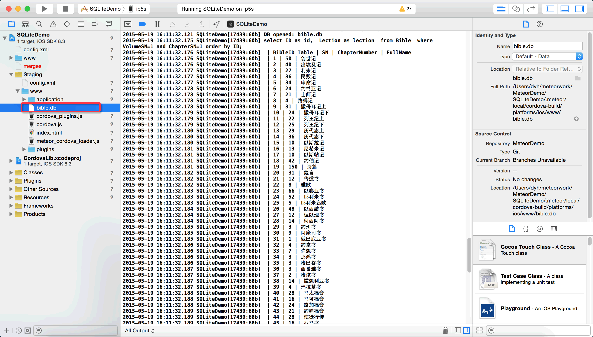
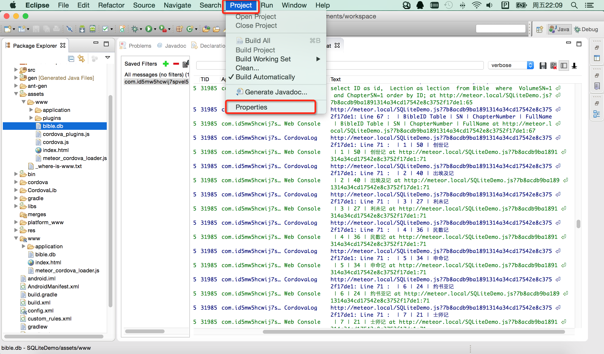
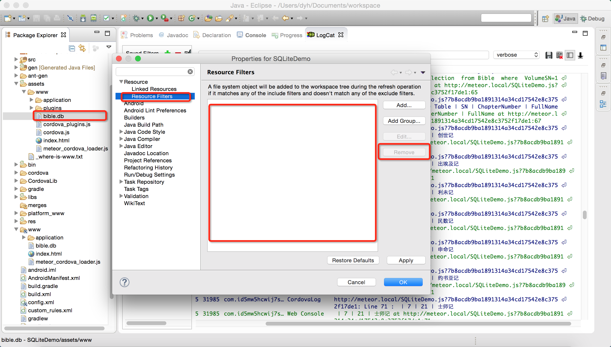

# 移动设备 - 操作SQLite示例程序 

SQLite Demo for Meteor on Mobile Device

## 注意

### iOS

在iOS设备中，数据库文件必须位于"/SQLiteDemo.app/www/"目录下。

所以，在Xcode中，先将数据库文件放在Meteor项目的 “/Staging/www/” 目录下，然后用XCode部署程序到iPhone即可。

### Android

在Android设备中，数据库文件必须位于"/data/app/com.id5mwhcwij7spvel5h8.apk/assets/www/"目录下，然后会被拷贝到"/data/data/com.id5mwhcwij7spvel5h8/databases/"目录下。

- 在eclipse中，Import|导入SQLiteDemo和CordovaApp-CordovaLib两个Android项目，因为《.meteor》文件夹是隐藏文件夹，很难在打开文件夹窗口看到，原谅我吧，我真的忘记是如何找到的了。。。

- 导入项目后，在eclipse中展开/SQLiteDemo/assets/目录，发现只有一个 "_where-is-www.txt" 文件，是因为工程将 /www/目录从assets目录中排除了。需要 在eclipse上方的菜单 "Project->Properties->左侧Resource->Resource Filters->右侧窗口Exclude all"下面的两项都删掉 ->Apply->OK，来确保文件会被成功部署到"/data/app/com.id5mwhcwij7spvel5h8.apk/assets/www/"目录下。这里看图比较直观。

- 删除Resource Filters里面的内容后，会发现www目录在assets目录中显示了。在Finder中找到bible.db文件，"command+c" 复制，在eclipse的"\assets\www\"目录上 "command+v" 将bible.db文件粘贴上去。

- 用eclipse部署程序到Android设备，可能会提示无法启动adb，可以用"活动监视器"将adb进程结束掉，再重启eclipse，即可正常部署和启动程序了。

## 使用的包

	$ meteor list

	autopublish                            1.0.3  Publish the entire database to ...
	cordova:io.litehelpers.cordova.sqlite  0.7.7
	insecure                               1.0.3  Allow all database writes by de...
	meteor-platform                        1.2.2  Include a standard set of Meteo...

## 下载

下载源代码：[请戳这里](https://github.com/MeteorChina/MeteorDemo/archive/master.zip)

## 感谢

- https://github.com/litehelpers/Cordova-sqlite-storage

若您要发表评论或提交问题，[请戳这里](https://github.com/MeteorChina/MeteorDemo/issues)

[dyh](https://github.com/dyh) 说：助人乃快乐之本！  ^_______^
