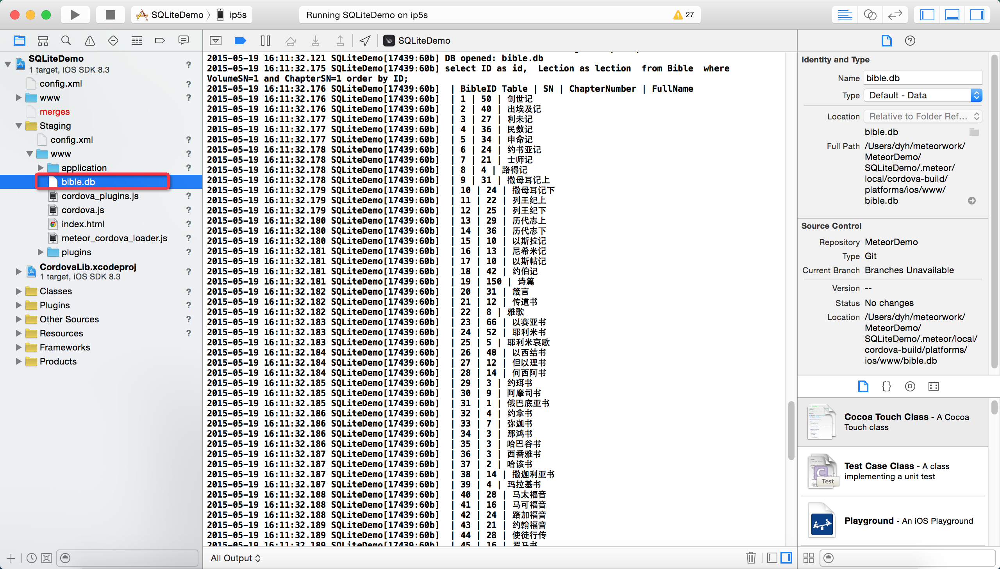

# 在移动设备上使用Meteor操作SQLite示例程序 

SQLite Demo for Meteor in Mobile

-----
# 注意

在iOS中，数据库文件必须放在www目录下
在Xcode中，先将数据库文件放在Meteor项目的 “/Staging/www/” 目录下，部署程序即可

若您要发表评论或提交问题，[请戳这里](https://github.com/MeteorChina/MeteorDemo/issues)

-----
# 使用的包

$ meteor list

autopublish                            1.0.3  Publish the entire database to ...

cordova:io.litehelpers.cordova.sqlite  0.7.7

insecure                               1.0.3  Allow all database writes by de...

meteor-platform                        1.2.2  Include a standard set of Meteo...

-----
# 下载

下载源代码：[请戳这里](https://github.com/MeteorChina/MeteorDemo/archive/master.zip)

-----
[dyh](https://github.com/dyh) 说：助人乃快乐之本！  ^_______^
